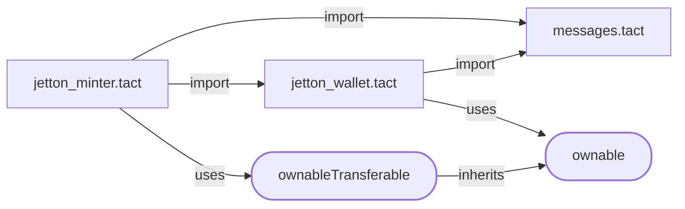

# Jetton (Fungible Token) Implementation in Tact


# **This will definitely be a stable version of Jettons, but not for now. Please, do not use this code in production. It might have some bugs.**

## Overview

This project includes a complete setup for working with Tact-based Jetton smart contracts. It provides:

- A pre-configured Tact compiler.
- Smart contracts written in the Tact language.
- TypeScript + Jest testing environment with `@ton/sandbox`.

## Goals

This implementation is fully compatible with the following TON standards:

- [TEP-64](https://github.com/ton-blockchain/TEPs/blob/master/text/0064-token-data-standard.md),
- [TEP-74](https://github.com/ton-blockchain/TEPs/blob/master/text/0074-jettons-standard.md),
- [TEP-89](https://github.com/ton-blockchain/TEPs/blob/master/text/0089-jetton-wallet-discovery.md).

You can use this implementation as an alternative to the reference Jetton contracts available in the [TON Blockchain repository](https://github.com/ton-blockchain/token-contract).

## Getting Started

### 1. Install Dependencies

Run the following command to install all required dependencies:

```bash
yarn install
```

### 2. Build Contracts

Compile the smart contracts with:

```bash
yarn build
```

### 3. Deploy Contracts

Customize your Jetton by editing the `contract.deploy.ts` file. This file also includes a detailed deployment guide. Deploy the contracts with:

```bash
yarn deploy
```

#### Deployment Verification

To verify that your Jetton contract was deployed correctly, you can use the built-in verification test:

Enable verification in your `.env` file:
```
enableDeployVerify=true
```

Run the verification test:
```bash
yarn verify
```

This verification test will check:
- If the contract is active
- If the contract parameters match what you specified
- If the contract metadata is correctly set up

### 4. Read Jetton Metadata

To read the metadata of a deployed Jetton, set the Jetton address in your `.env` file:

```
JETTON_ADDRESS=EQYour_Jetton_Address_Here
```

Then run:

```bash
yarn read
```

This will display:

- General Jetton information (total supply, mintable status, owner)
- Jetton metadata (name, symbol, description, image, etc.)
- A link to view the Jetton in a blockchain explorer

### 5. Test Contracts

Run tests in the `@ton/sandbox` environment:

```bash
yarn test
```

## Jetton Architecture

If you're new to Jettons, read the [TON Jettons Processing](https://docs.ton.org/develop/dapps/asset-processing/jettons).

## Project Structure

Smart contracts, their tests, and the deployment script are located in the `src` directory:

```
src/
│
│   # Contracts and auxiliary Tact code
├── contracts/
│   ├── jetton-minter.tact
│   ├── jetton-wallet.tact
│   ├── messages.tact
│   └── constants.tact
│
│   # Tests
├── tests/
│   └── jetton.spec.ts
│
│   # Deployment script
├── scripts/
│   ├── contract.deploy.ts
│   └── contract.read.ts
│
│   # Miscellaneous utility things
└── utils/
```

Note that tests and the deployment script require the compiled contracts to be present in the `src/output` directory.

The configuration for the Tact compiler is in `tact.config.json` in the root of the repository. In most cases, you won't need to change this file.

## Smart Contracts Structure

The main smart contract is `jetton_minter.tact`, it imports `messages.tact` and `jetton_wallet.tact`. With the default configuration of `tact.config.json` targeting `jetton_minter.tact`, they're all compiled automatically.

### Inherited traits

Jetton Minter uses only _OwnableTransferable_, which is inherited from the _Ownable_ trait. Jetton Wallet only uses the _Ownable_ trait. All these traits come from the Tact's [standard libraries](https://docs.tact-lang.org/ref/standard-libraries/).

Schemes of inheritance and imports:



Read more about those traits in the [Tact standard library](https://docs.tact-lang.org/ref/standard-libraries/).

## Best Practices

- For guidance on interacting with Jettons using Tact, read the [Jetton cookbook](https://docs.tact-lang.org/cookbook/jettons/).
- Be cautious of fake messages sent by scammers. Read [security best practices](https://docs.tact-lang.org/book/security-best-practices/) to protect yourself from fraudulent activities.
- Always consult the [official Tact documentation](https://docs.tact-lang.org/) for additional resources and support.

## License

This project is licensed under the MIT License.
