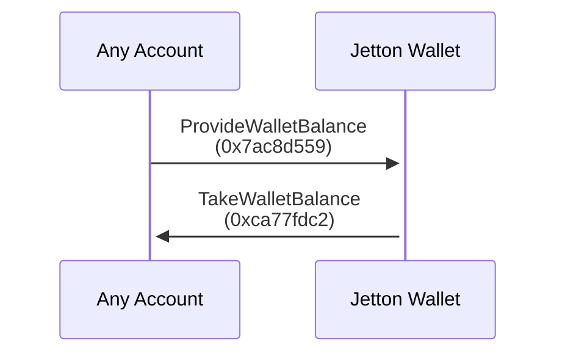
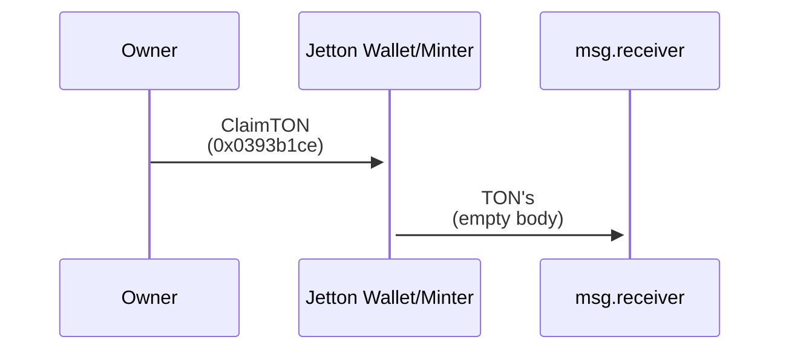
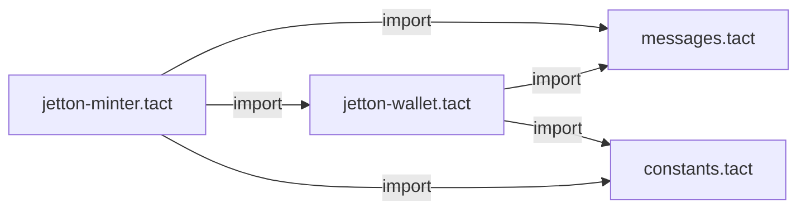

# Jetton (Fungible Token) Implementation in Tact

[](https://gist.github.com/Kaladin13/3d2f2d0b3e2f5a81f77d8e490e3b2807#file-deploy-result-json)

## Overview

This project includes a complete setup for working with Tact-based Jetton smart contracts. It provides:

- A pre-configured Tact compiler.
- Smart contracts written in the Tact language.
- TypeScript + Jest testing environment with `@ton/sandbox`.
- Gas usage benchmarks throughout different versions

## Goals

This implementation is fully compatible with the following TON standards:

- [TEP-64](https://github.com/ton-blockchain/TEPs/blob/master/text/0064-token-data-standard.md),
- [TEP-74](https://github.com/ton-blockchain/TEPs/blob/master/text/0074-jettons-standard.md),
- [TEP-89](https://github.com/ton-blockchain/TEPs/blob/master/text/0089-jetton-wallet-discovery.md).

You can use this implementation as an alternative to the reference Jetton contracts available in the [TON Blockchain repository](https://github.com/ton-blockchain/token-contract).

You can read [Specification](./SPEC.md), that goes into the design choices and differences between this and other implementations

## Improvements and additional features

This implementation also includes new features, that will allow developers and users on TON to easier integrate and work with Jettons in their applications

### Balance on-chain API

This additional receiver provides functionality similar to [TEP-89](https://github.com/ton-blockchain/TEPs/blob/master/text/0089-jetton-wallet-discovery.md), but with wallet balance. You can request and then receive balance from any Jetton wallet with possible additional info for transaction verification

#### Transaction scheme



#### TLB

```tlb
provide_wallet_balance#7ac8d559 receiver:MsgAddress include_verify_info:Bool = InternalMsgBody;

verify_info$_ owner:MsgAddress minter:MsgAddress code:^Cell = VerifyInfo;
take_wallet_balance#ca77fdc2 balance:Coins verify_info:(Maybe VerifyInfo) = InternalMsgBody;
```

### Claim TON from Jetton Wallet/Minter

These receivers both on Jetton Wallet and Jetton Minter allow to claim stale TON coins from contracts, leaving just enough balance for them to not freeze and function properly. Message body includes `receiver` field, that allows to specify funds receiver

#### Transaction scheme



#### TLB

```tlb
claim_ton#0393b1ce receiver:MsgAddress = InternalMsgBody;
```

## Getting Started

### 1. Install Dependencies

Run the following command to install all required dependencies:

```bash
yarn install
```

### 2. Build Contracts

Compile the smart contracts with:

```bash
yarn build
```

### 3. Deploy Contracts

Customize your Jetton by editing the `contract.deploy.ts` file. This file also includes a detailed deployment guide. Deploy the contracts with:

```bash
yarn deploy
```

#### 4. Deployment Verification

To verify that your Jetton contract was deployed correctly, you can use the built-in verification test:

Run the verification test:

```bash
yarn verify-deployment
```

This verification test will check:

- If the contract is active
- If the contract parameters match what you specified
- If the contract metadata is correctly set up

### 5. Read Contract Data

You can read on-chain data for the minter from its address using script `src/scripts/contract.read.ts`

```bash
yarn read
```

### 6. Test Contracts

Run tests in the `@ton/sandbox` environment:

```bash
yarn test
```

### 6. Benchmark Contracts

To run gas usage benchmarks and get them printed in the table, use

```bash
yarn bench
```

If you want to modify the contracts and benchmark your implementation, you can run

```bash
# add to add new entry
yarn bench:add
# or update to replace latest
yarn bench:update
```

After that, use `yarn bench` to pretty-print the difference table with your results in it

## Jetton Architecture

If you're new to Jettons, read the [TON Jettons Processing](https://docs.ton.org/develop/dapps/asset-processing/jettons).

## Project Structure

Smart contracts, their tests, and the deployment script are located in the `src` directory:

```
src/
│
│   # Contracts and auxiliary Tact code
├── contracts/
│   ├── jetton-minter.tact
│   ├── jetton-wallet.tact
│   ├── messages.tact
│   └── constants.tact
│
│   # Tests
├── tests/
│   ├── extended.spec.ts
│   └── jetton.spec.ts
│
│   # Deployment script
├── scripts/
│   ├── contract.deploy.ts
│   └── contract.read.ts
│
│   # Miscellaneous utility things
└── utils/
```

Note that tests and the deployment script require the compiled contracts to be present in the `src/output` directory.

The configuration for the Tact compiler is in `tact.config.json` in the root of the repository. In most cases, you won't need to change this file.

## Smart Contracts Structure

The main smart contract is `jetton-minter.tact`, it imports `messages.tact`, `constants.tact` and `jetton-wallet.tact`. With the default configuration of `tact.config.json` targeting `jetton-minter.tact`, they're all compiled automatically.

Scheme of imports:



Read more about imports in the [Tact standard library](https://docs.tact-lang.org/ref/standard-libraries/).

## Best Practices

- For guidance on interacting with Jettons using Tact, read the [Jetton cookbook](https://docs.tact-lang.org/cookbook/jettons/).
- Be cautious of fake messages sent by scammers. Read [security best practices](https://docs.tact-lang.org/book/security-best-practices/) to protect yourself from fraudulent activities.
- Always consult the [official Tact documentation](https://docs.tact-lang.org/) for additional resources and support.
- Check [Specification](./SPEC.md) for more in-depth dive into implementation details

## License

This project is licensed under the MIT License.
