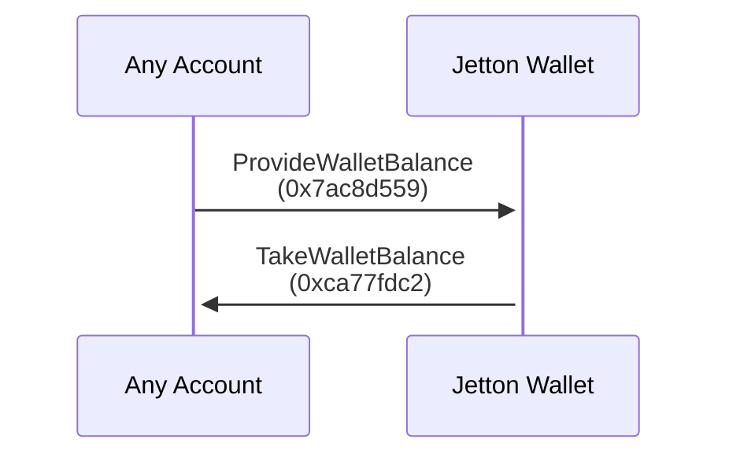
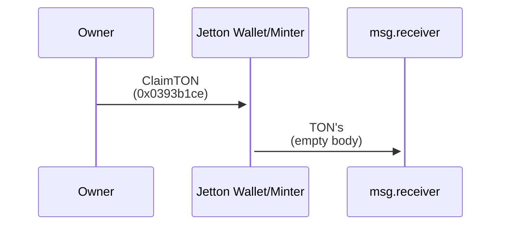

# Tact-Native Jetton Implementation

This documents discusses design choices and differences between this and other jetton implementations

## Gas assertions

There are a few ways to deal with [TEP-74](https://github.com/ton-blockchain/TEPs/blob/master/text/0074-jettons-standard.md) defined gas constraints and storage fees:

- Precalculated in emulation gas constants
- Hardcoded raw tons amount
- Runtime calculations using latest blockchain configuration
- Original forward fee approximations

We decided to use a mixed approach:

#### Hardcoded ton amount with `nativeReserve` and SendMode `SendRemainingBalance` for storage phase assertions

We moved away from using `myStorageDue()` or `getStorageFee()` to work with storage fees since big enough constant to not allow contract freezing together with the ability to [claim TON](#claim-ton-from-jetton-walletminter) from both Minter and Wallet contracts are good solution that will work in all production use-cases

```tact
const minTonsForStorage: Int = ton("0.01");

nativeReserve(minTonsForStorage, ReserveExact | ReserveBounceIfActionFail);

message(MessageParameters {
    to: msg.receiver,
    value: 0,
    mode: SendRemainingBalance,
});
```

#### Precalculated gas constants and forward fee approximations for compute/action phase assertions

This is combination of two techniques:

- Using gas constants with `getComputeFee()` to always get precise compute fees in tons
- Using `ctx.readForwardFee()` for approximation when the outgoing message size is always smaller or the same compared to the incoming

```tact
const gasForTransfer: Int = 8000;

let ctx = context();
let fwdCount = 1 + sign(msg.forwardTonAmount);

require(
    ctx.value >
    msg.forwardTonAmount +
    fwdCount * ctx.readForwardFee() +
    (2 * getComputeFee(gasForTransfer, false) + minTonsForStorage),
    "Insufficient amount of TON attached",
);
```

## Features

We have added additional receivers, not specified by TEP, but long awaited by devs

### Balance on-chain API

Not being able to know the balance of other address implies certain obstacles in the implementation of complex DeFi.
This additional receiver provides functionality similar to [TEP-89](https://github.com/ton-blockchain/TEPs/blob/master/text/0089-jetton-wallet-discovery.md), but with wallet balance. You can request and then receive balance from any Jetton wallet with possible additional info for transaction verification

#### Transaction scheme



#### TLB

```tlb
provide_wallet_balance#7ac8d559 receiver:MsgAddress include_verify_info:Bool = InternalMsgBody;

verify_info$_ owner:MsgAddress minter:MsgAddress code:^Cell = VerifyInfo;
take_wallet_balance#ca77fdc2 balance:Coins verify_info:(Maybe VerifyInfo) = InternalMsgBody;
```

### Claim TON from Jetton Wallet/Minter

These receivers both on Jetton Wallet and Jetton Minter allow to claim stale TON coins from contracts, leaving just enough balance for them to not freeze and function properly. Message body includes `receiver` field, that allows to specify funds receiver

#### Transaction scheme



#### TLB

```tlb
claim_ton#0393b1ce receiver:MsgAddress = InternalMsgBody;
```
