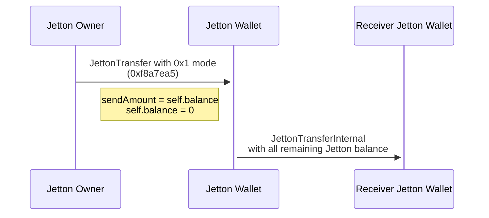
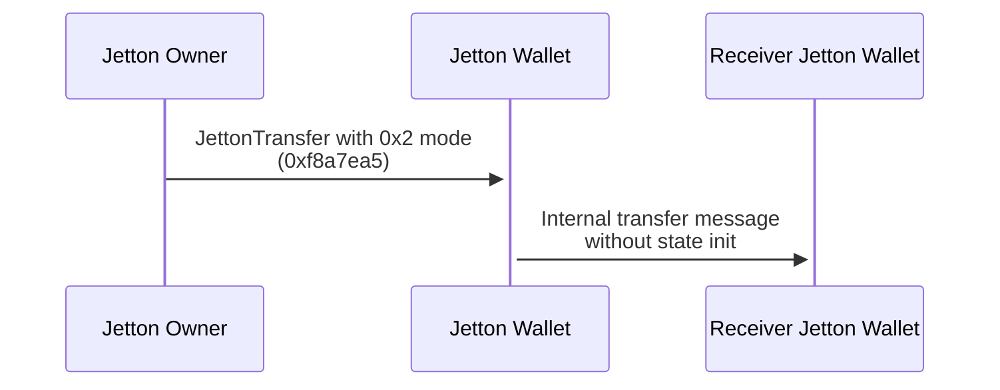
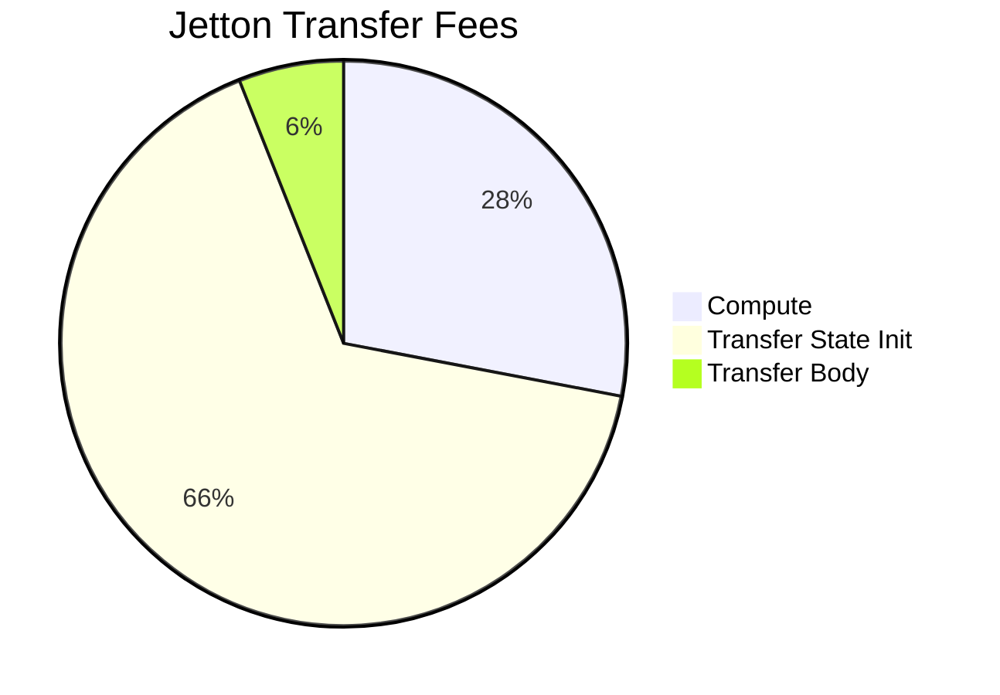
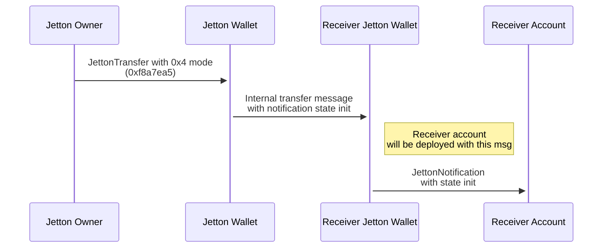
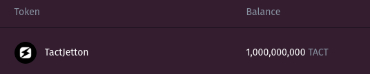

# Feature-rich Jetton implementation in Tact

Since the [initial TEP-74](https://github.com/ton-blockchain/TEPs/blob/master/text/0074-jettons-standard.md) publication in 12.03.2022, there were only a few attempts to improve the standard and introduce new features:

- [Mintless Jetton](https://github.com/ton-community/mintless-jetton), used for mass token distribution
- [Governance Jetton](https://github.com/ton-blockchain/stablecoin-contract), used for USDT (this implementation actually breaks TEP-74 by removing burn)
- [Modern Jetton](https://github.com/EmelyanenkoK/modern_jetton), allowing TON/Jetton claiming

To this day, Mintless Jetton is the only widely known implementation that uses the `custom_payload` field in the original `transfer#0f8a7ea5` TL-B. The so-called [feature-rich](../src/contracts/feature-rich/) version in this repository is a TEP-74 compatible Jetton implementation in Tact that utilizes `custom_payload` to introduce new features to the standard.

## Jetton send modes

The feature-rich version introduces Jetton send modes. They are similar to [basic message send modes](https://docs.ton.org/v3/documentation/smart-contracts/message-management/message-modes-cookbook) in the sense that they are serialized as several binary flags that can be combined to affect the semantics of Jetton transfers.

Currently, there are 3 Jetton send modes:

- `SendAllJettonsMode`, 0x1
- `SendNotDeployReceiversJettonWallet`, 0x2
- `SendStateInitWithJettonNotification`, 0x4

TL-B for the new custom payload looks like this:

```tlb
_ mode:uint32
  forwardStateInit:(Maybe StateInit) = CustomPayloadWithSendModes;
```

Mode is a `uint32` number that should include different send modes added together arithmetically, just like basic messages send modes. The `forwardStateInit` field is optional and is only needed in the `SendStateInitWithJettonNotification` mode, which will be discussed later.

#### SendAllJettonsMode

This mode straight-forward copies the semantics of 128 basic messages send mode. It drops the specified `amount` of Jettons from the transfer message and instead sends all remaining jettons from this Jetton wallet. This can be useful for various DeFi services that want to move all funds from one account to another.



### SendNotDeployReceiversJettonWallet

In all previous implementations, the Jetton wallet always attached `state_init` to the `internal_jetton_transfer` message to deploy the receiving Jetton wallet, in case it was the first time the receiver received this Jetton. However, `state_init` will be ignored if the contract is already deployed, but the sender account will still pay the forward fee for it.

This send mode allows for not attaching `state_init` in the `internal_jetton_transfer` message. From a security perspective, if the receiving Jetton wallet was not actually deployed, then the message without `state_init` will bounce back, and no Jetton will be lost in this situation. The most useful application of this send mode can be seen in DEXes, where they are certain that Jetton wallets for their vaults are deployed (since the pool already exists), so there is no need to attach `state_init` and incur unnecessary network fees.



With the current [network config](https://tonviewer.com/config) and prices as of May 30th, 2025, the forward fee for a Tact Jetton wallet `state_init` is `9_600_000` nanoToncoin, or `0.0096` Toncoin. If we [assume](https://tonviewer.com/EQBSUY4UWGJFAps0KwHY4tpOGqzU41DZhyrT8OuyAWWtnezy) that the Jetton-to-Jetton DEX pool has about 3000 daily swaps, that means we can save up to `28.8` Toncoin of network transfer fees on Jetton transfers with a guaranteed deployed Jetton wallet on this single pool.



### SendStateInitWithJettonNotification

This mode requires an additional field, `forwardStateInit,` to be included in the custom payload.

When `transfer_notification#7362d09c` is sent from the receiver's Jetton wallet, it simply carries the forward payload and forward Toncoin amount as value, acting like an asynchronous callback on the transfer event. A huge limitation to the practical use of this callback is that the notification-receiving contract should already be deployed. To execute logic after a successful Jetton transfer on-chain, send two messages: one for the callback contract deployment and a second for the transfer itself.

The ability to deploy the notification receiver together with the notification would solve this issue. This send mode retrieves the `forwardStateInit` field from the custom payload on the Jetton transfer, attaches it to the internal transfer, and then uses it as `state_init` in the transfer notification message.



**Note!**

If we attach `state_init` to the notification message, the destination address of this message is derived from the hash of this state. However, following the TEP, we should send the notification to the `owner` address. If these two addresses don't match, the transaction will fail and bounce the internal transfer back, canceling the operation.

```tact
let deployAddress = contractAddress(msg.forwardStateInit!!);
require(deployAddress == self.owner, "Deploy address doesn't match owner address");
```

## Usage

Feature-rich Jetton implementation is designed and implemented to be fully compatible with TEP Jetton-related standards. That means it can be used with existing applications, such as explorers and wallets, without any modifications.



To deploy a feature-rich Jetton, run `yarn deploy:feature-rich`, which uses [this deployment script](../src/scripts/feature-rich.deploy.ts).

It is possible to make use of Jetton send modes using the `sendTransferWithJettonMode` method from wrapper class [ExtendedFeatureRichJettonWallet](../src/wrappers/ExtendedFeatureRichJettonWallet.ts). More examples of modes usage can be found in the [feature-rich tests](../src/tests/feature-rich/feature-rich.spec.ts).

## References

- [TEP-74 standard](https://github.com/ton-blockchain/TEPs/blob/master/text/0074-jettons-standard.md)
- [Initial community discussion post (in Russian)](https://t.me/TheOpenDevBlog/68)
