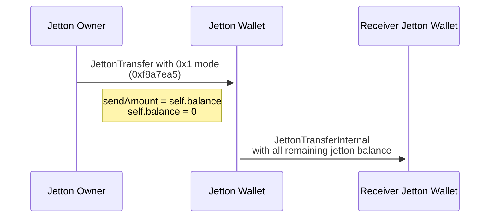
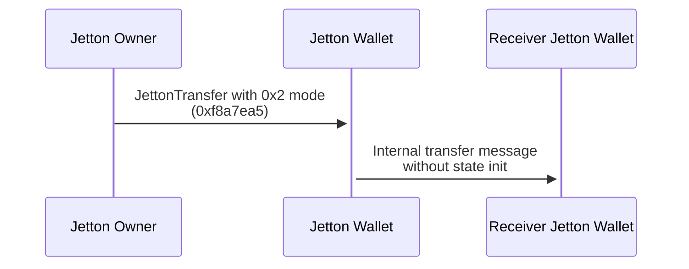
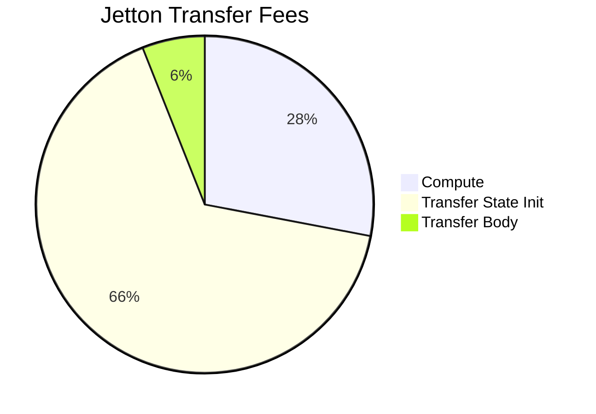
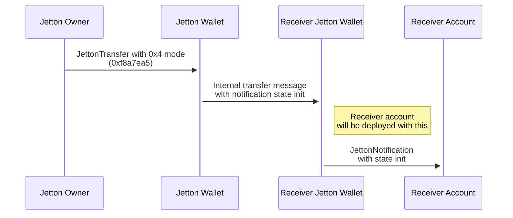

# Jetton Send Modes implementation in Tact

Since the [initial TEP-74](https://github.com/ton-blockchain/TEPs/blob/master/text/0074-jettons-standard.md) publication in 12.03.2022, there were only a few attempts to improve the standard and introduce new features:

- Mintless jetton, used for mass token distribution
- Governance jetton, used for USDT (this implementation actually breaks TEP-74 by removing burn)
- [Modern jetton](https://github.com/EmelyanenkoK/modern_jetton), allowing ton/jetton claiming

To this day, Mintless jetton is the only widely known implementation that uses `custom_payload` field in the original `transfer#0f8a7ea5` TL-B. So-called [`feature-rich`](../src/contracts/feature-rich/) version in this repo is TEP-74 compatible jetton implementation in Tact that uses `custom_payload` to bring new features to the standard

### Jetton send modes

Feature rich version introduces _Jetton send modes_. They are similar to basic messages send modes in a sense that they are serialized as number of binary flags that can be combined together to affect the semantics of jetton transfers.

Currently there are 3 jetton send modes:

- `SendAllJettonsMode`, 0x1
- `SendNotDeployReceiversJettonWallet`, 0x2
- `SendStateInitWithJettonNotification`, 0x4

TL-B for new custom payload looks like this:

```tlb
_ mode:uint32
  forwardStateInit:(Maybe StateInit) = CustomPayloadWithSendModes;
```

Mode is `uint32` number that should include different send modes added together arithmetically, just like basic messages send modes. `forwardStateInit` field is optional and only needed in the `SendStateInitWithJettonNotification` mode, it will be discussed later.

#### SendAllJettonsMode

This mode straight-forward copies the semantics of 128 basic messages send mode. It drops whatever jetton `amount` was specified in the transfer message before and instead sends all remaining jetton balance from this jetton wallet. This can be useful for various DeFi services that want to simply move all funds from one account to another.



#### SendNotDeployReceiversJettonWallet

In all previous implementations jetton wallet always attached `state_init` in the `internal_jetton_transfer` message to deploy the receiving jetton wallet, in case it's the first time the receiver gets this jetton sent to him. However, `state_init` will be simply ignored if the contract is already deployed, but the sender account will still pay the forward fee for it.

This send mode allows not to attach `state_init` in the `internal_jetton_transfer` message. From security perspective, if the receiving jetton wallet in reality was not deploy than the message without `state_init` will simply bounce back, no jetton will be lost in this situation. The most useful application of this send mode could be made in DEXes: they know for sure that jetton wallets for their vaults are deployed (since the pool exists in the first place), so there is no need to attach `state_init` and overpay the network fees.



With current network config and prices (30.05.2025) forward fee for Tact jetton wallet `state_init` is 9_600_000 nanoton, or **0.0096 ton**. If we assume\* that on average Jetton-to-Jetton DEX pool has about 3000 daily swaps, that means that we can save up to **28.8 ton** of network transfer fees on jetton transfers with guaranteed deployed jetton wallet on this single pool.



#### SendStateInitWithJettonNotification

This mode requires additional field `forwardStateInit` to be included in the custom payload.

When `transfer_notification#7362d09c` is sent from the receivers jetton wallet, it simply carries the forward payload and forward ton amount as value, acting like asynchronous callback on the transfer event. Huge limitation to the practical usage of this callback is the fact that notification receiving contract should already be deployed. So if you want to execute some kind of logic after the successful jetton transfer on-chain, you should send two messages, one for callback contract deploy and the second one for the transfer itself.

The ability to deploy the notification receiver together with the notification would solve this issue. This send mode takes the `forwardStateInit` field from the custom payload on jetton transfer, attaches it to the internal transfer and then uses it as `state_init` on the transfer notification message.



**Note!**

If we attach `state_init` to the notification message, the destination address of this message is derived from the hash of this state. However, following the TEP, we should send the notification to the `owner` address. If this two addresses don't match, transaction will fail and bounce internal transfer back, cancelling the operation.

```tact
let deployAddress = contractAddress(msg.forwardStateInit!!);
require(deployAddress == self.owner, "Deploy address doesn't match owner address");
```
